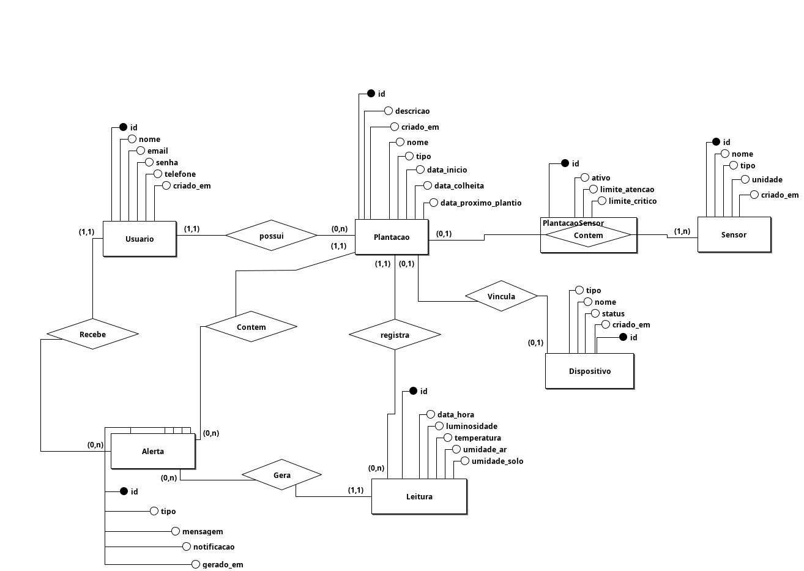
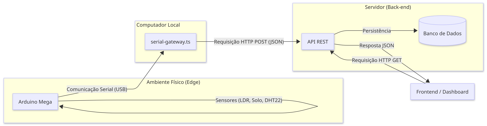

# 🌱 AgroSensor

Sistema inteligente de monitoramento climático voltado ao apoio da agricultura familiar no Vale do Jequitinhonha, utilizando IoT, sensores ambientais, gateway serial e visualização de dados em tempo real.

---

## 📌 Sobre o Projeto

O **AgroSensor** é um sistema de monitoramento climático desenvolvido para auxiliar pequenos produtores rurais no acompanhamento das condições ambientais da plantação.

O projeto utiliza sensores conectados a um **Arduino Mega 2560** para coletar dados ambientais em tempo real, transmitindo as informações para um backend responsável pelo processamento, armazenamento e visualização dos dados.

A proposta foi idealizada considerando os desafios enfrentados pela agricultura familiar no **Vale do Jequitinhonha**, região marcada pelo clima semiárido, altas temperaturas e períodos prolongados de seca.

O sistema busca oferecer uma solução acessível e de baixo custo para apoiar o uso racional da água, melhorar o monitoramento agrícola e auxiliar na tomada de decisões relacionadas ao plantio e irrigação.

---

## 🎯 Objetivos

* Monitorar variáveis ambientais em tempo real;
* Auxiliar produtores rurais na tomada de decisões agrícolas;
* Coletar e armazenar dados climáticos;
* Gerar alertas ambientais;
* Desenvolver uma arquitetura IoT aplicada à agricultura familiar;
* Promover acessibilidade tecnológica para pequenos produtores.

---

## Arquitetura do Sistema

```text
Sensores -> Arduino Mega -> Gateway Serial -> API REST -> Banco de Dados -> Dashboard
```

---

## ⚙️ Tecnologias Utilizadas

## Hardware

* Arduino Mega 2560
* Sensor DHT22 (temperatura e umidade do ar)
* Sensor de Umidade do Solo HW-080
* Sensor de Luminosidade LDR

---

## 💻 Software

* Node.js
* Express.js
* Prisma ORM
* SQLite
* JavaScript
* Gateway Serial USB
* API REST
* Git e GitHub

---

## Funcionalidades

* Coleta de temperatura ambiente;
* Coleta de umidade do ar;
* Monitoramento da umidade do solo;
* Leitura de luminosidade;
* Transmissão serial de dados;
* Integração entre Arduino e backend;
* Armazenamento de leituras ambientais;
* Sistema de alertas climáticos;
* Estrutura preparada para dashboards e visualização de dados.

---

## Modelagem do Banco de Dados

O sistema foi modelado utilizando banco relacional com suporte às seguintes entidades:

* Usuários
* Plantações
* Sensores
* Leituras
* Alertas
* Associação entre sensores e plantações

A modelagem permite:

* múltiplas plantações por usuário;
* múltiplos sensores por plantação;
* definição de limites de atenção e críticos;
* geração de alertas automáticos.

---

## Funcionamento do Gateway

O gateway é responsável por:

* receber os dados enviados pelo Arduino via comunicação serial;
* validar os dados recebidos;
* converter os valores para formato adequado;
* encaminhar as leituras para a API REST.

Essa arquitetura desacoplada permite maior organização e escalabilidade do sistema.

---

## Estrutura do Projeto

```bash
agrosensor/
├── arduino
│   └── main
│       ├── main.ino
│       ├── main.test
│       └── sketch.yaml
├── backend
│   ├── package.json
│   ├── package-lock.json
│   ├── prisma
│   │   ├── dev.db
│   │   ├── migrations
│   │   │   ├── 20260523222121_criacao_tabelas_iniciais
│   │   │   │   └── migration.sql
│   │   │   ├── 20260524210005_migracao_limites_para_vinculo
│   │   │   │   └── migration.sql
│   │   │   ├── 20260526212531_adiciona_tabela_dispositivo
│   │   │   │   └── migration.sql
│   │   │   ├── 20260527001656_transforma_sensores_em_itens_fisicos
│   │   │   │   └── migration.sql
│   │   │   ├── 20260527004950_otimiza_leituras_para_formato_linear
│   │   │   │   └── migration.sql
│   │   │   ├── 20260604045227_ajusta_exclusividade_sensores_e_dispositivo
│   │   │   │   └── migration.sql
│   │   │   └── migration_lock.toml
│   │   ├── schema.prisma
│   │   ├── seed-performance.ts
│   │   └── seed.ts
│   ├── prisma.config.ts
│   ├── src
│   │   ├── controllers
│   │   │   ├── leitura.controller.ts
│   │   │   └── usuario.controller.ts
│   │   ├── env
│   │   │   └── index.ts
│   │   ├── lib
│   │   │   └── prisma.ts
│   │   ├── models
│   │   │   ├── Alerta.model.ts
│   │   │   ├── Dispositivo.model.ts
│   │   │   ├── Leitura.model.ts
│   │   │   ├── Plantacao.model.ts
│   │   │   ├── Sensor.model.ts
│   │   │   └── Usuario.model.ts
│   │   ├── routes
│   │   │   ├── alerta.route.ts
│   │   │   ├── dispositivo.route.ts
│   │   │   ├── index.route.ts
│   │   │   ├── leitura.route.ts
│   │   │   ├── plantacao.route.ts
│   │   │   ├── sensor.route.ts
│   │   │   └── usuario.route.ts
│   │   ├── server.ts
│   │   └── services
│   │       ├── alerta.service.ts
│   │       ├── dispositivo.service.ts
│   │       ├── leitura.service.ts
│   │       ├── plantacao.service.ts
│   │       ├── sensor.service.ts
│   │       └── usuario.service.ts
│   └── tsconfig.json
├── design-ux-ui
├── documentacao
│   ├── atas-reuniao.md
│   ├── casos-de-uso.md
│   ├── diagramas
│   │   ├── diagrama_projeto.png
│   │   ├── logico_1_old.brM3
│   │   ├── modelo_conceitual_final.confia.brM3
│   │   ├── modelo_conceitual_final.confia.png
│   │   ├── modelo_conceitual_old.brM3
│   │   ├── modelo_conceitual_old.png
│   │   └── README.md
│   ├── fontes.md
│   ├── modelagem-banco.md
│   ├── projeto.md
│   ├── referencias
│   │   └── artigos.md
│   ├── referencias.md
│   ├── regras-negocio.md
│   └── requisitos.md
├── frontend
├── gateway
│   ├── package.json
│   ├── package-lock.json
│   ├── src
│   │   ├── env
│   │   │   └── index.ts
│   │   └── serial-gateway.ts
│   └── tsconfig.json
└── README.md

27 directories, 64 files
```

---

## Diagramas do Projeto

## Modelo Conceitual



---

## Arquitetura do Sistema



---

## Como Executar o Projeto

### Clone o repositório

```bash
git clone git@github.com:carolainux/integrador-ifnmg-equipe2.git
```

---

### Acesse a pasta do projeto

```bash
cd integrador-ifnmg-equipe2
```

---

### Backend

#### Instalar dependências

```bash
cd backend
npm install
```

---

### Executar servidor

```bash
npm run dev
```

---

### Gateway

#### Instalar dependências

```bash
cd gateway
npm install
```

---

### Executar gateway serial

```bash
node serial-gateway.js
```

---

#### Arduino

Faça upload do arquivo:

```text
arduino/main/main.ino
```

para o Arduino Mega 2560 utilizando a IDE do Arduino.

---

## Futuras Implementações

* Dashboard web interativo;
* Sistema de autenticação;
* Alertas em tempo real;
* Integração com notificações;
* Histórico climático;
* Gráficos estatísticos;
* Deploy em nuvem;
* Aplicativo mobile.

---

## 📍 Contexto Regional

O projeto possui foco social e tecnológico voltado ao município de Araçuaí e ao Vale do Jequitinhonha, buscando oferecer soluções acessíveis para agricultura familiar em regiões afetadas pela escassez hídrica.

---

## 👥 Equipe

Projeto desenvolvido para a disciplina de Projeto Integrador.

* **Carolaine Costa** — Product Owner (PO)
  GitHub: @carolainux

* **Alex Alves Santos** — Backend Developer
  GitHub: @Alex-spec892

* **Jailson Santos da Silva** — Backend Developer
  GitHub: @jamsnxs

* **Sandy Barbosa Fonseca** — Frontend Developer & UX/UI Designer
  GitHub: @ceosemjunior

* **Cybelle Leandro Bittencourt** — QA / Tester
  GitHub: @cybellebitt21

---

## 📄 Licença

Este projeto possui finalidade acadêmica e educacional.
